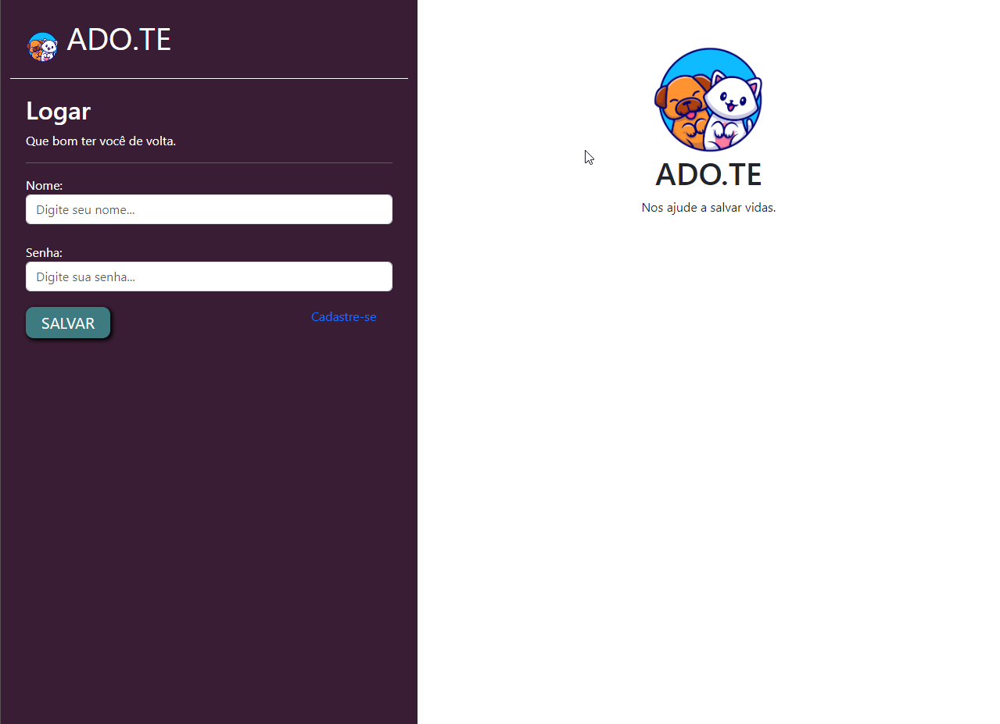
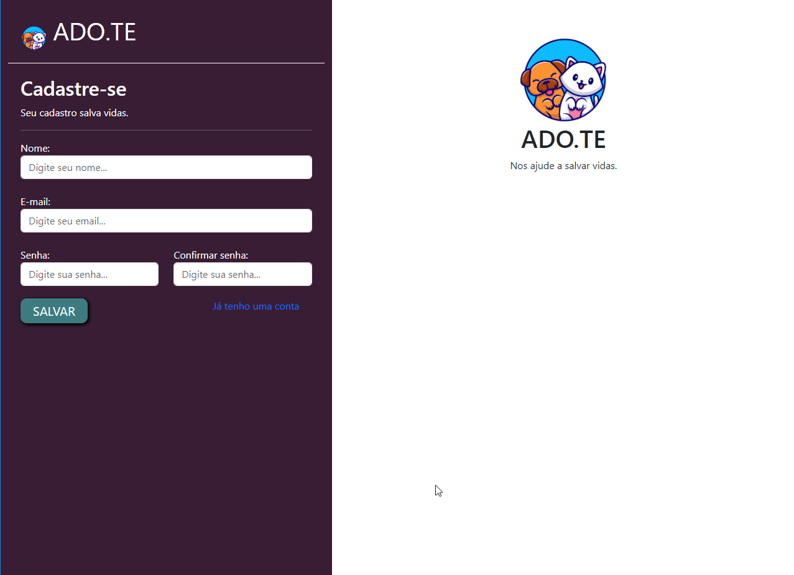

<p align="center">
  
</p>

<h1 class='unlisted'><center>ADO.TE</center></h1>

<center>A Pet Adoption Project</center>

<br><br>

<center>

   

</center>


🚧 **Ado.te is under development** 🚧

## Layout





## Building

## Create the project and virtual environment

```bash
mkdir adote && cd $_
python3 -m venv venv
source venv/bin/activate
```

## Install libs

```bash
pip3 install django
python3 -m pip install --upgrade pip
pip3 install pillow
```

## Criar o projeto

```bash
django-admin startproject adote .
```